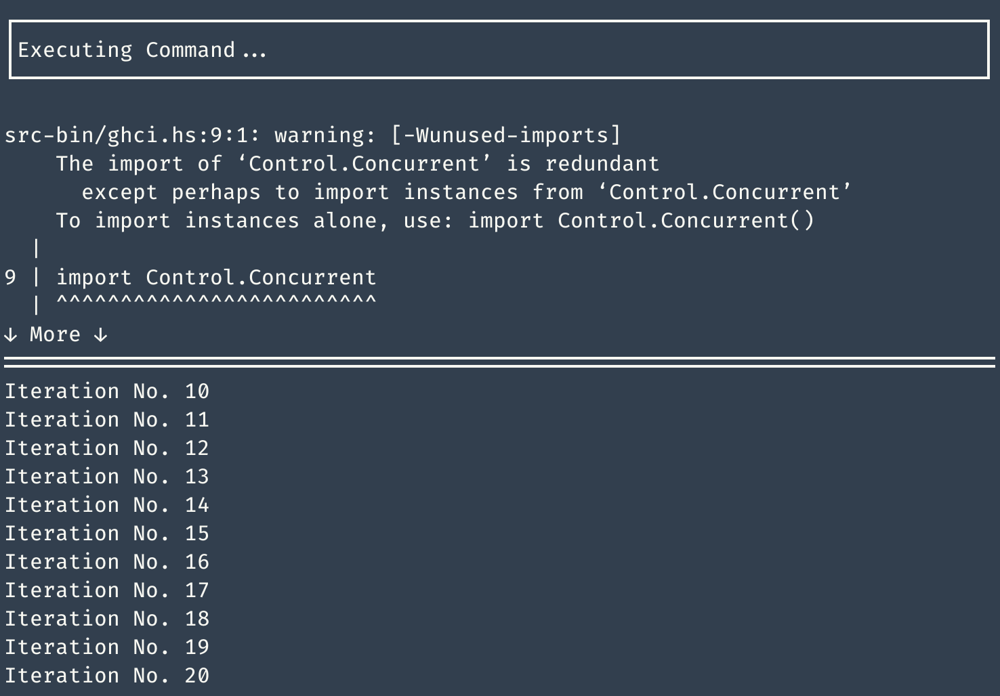

reflex-ghci
==============

[](https://hackage.haskell.org/package/reflex-ghci) [](https://matrix.hackage.haskell.org/#/package/reflex-ghci) [](https://travis-ci.org/reflex-frp/reflex-ghci)

Library
-------
A functional-reactive wrapper around GHCi that uses filesystem notifications to automatically reload haskell source files.

Executable
----------



This package includes a [reflex-vty](https://github.com/reflex-frp/reflex-vty)-based executable, shown above. Module information (errors, warnings, etc) is shown in a scrollable pane on the top half of the screen and the output of any expression you (optionally) choose to evaluate is shown in a scrollable pane on the bottom half. The panes are resizable using the mouse.

```bash
$ reflex-ghci -h
Welcome to reflex-ghci!

Usage: <interactive> [-c|--command COMMAND] [-e|--expression EXPR]
  Run a Haskell REPL that automatically reloads when source files change.

Available options:
  -c,--command COMMAND     The ghci/cabal repl command to
                           run (default: "cabal repl")
  -e,--expression EXPR     The optional expression to evaluate once modules have
                           successfully loaded (default: no expression)
  -h,--help                Show this help text
```

Acknowledgements
----------------
Inspired by the fantastic [ghcid](https://github.com/ndmitchell/ghcid) project.
